# NOVA VLM

A research framework for benchmarking vision-language models on medical imaging tasks using the NOVA brain-MRI dataset. It evaluates models on localization, captioning, and diagnosis tasks using agentic multi-turn reasoning with visual tools and web search.

## Overview

The NOVA VLM framework enables systematic evaluation of vision-language models on medical imaging tasks. It provides tools for:

- **Multi-model evaluation**: Support for OpenAI models and 100+ models via OpenRouter
- **Agentic processing**: Multi-turn reasoning with visual tools (zoom, crop, contrast, threshold)
- **Web search integration**: Real-time PubMed search for medical literature
- **Comprehensive metrics**: Automated evaluation for all NOVA benchmark tasks
- **Batch processing**: Efficient async processing with rate limiting and retry logic
- **Interactive analysis**: Streamlit GUI and visualization tools

## Repository Structure

```mermaid
graph TD
    A[nova_retrieval_vlm/] --> B[src/nova_retrieval_vlm/]
    A --> C[tests/]
    A --> D[scripts/]
    A --> E[docs/]
    A --> F[paper/]
    A --> G[data/]
    A --> H[runs/]
    A --> I[indexes/]
    
    B --> B1[cli.py - Main CLI interface]
    B --> B2[config.py - Configuration management]
    B --> B3[models/ - Model adapters]
    B --> B4[evaluation/ - Task metrics]
    B --> B5[processors/ - Task processors]
    B --> B8[prompts/ - Jinja2 templates]
    B --> B9[visualization/ - GUI & plotting]
    B --> B10[types.py - Type definitions]
    B --> B11[utils/ - Utilities]
    
    C --> C1[test_types.py - Type system tests]
    C --> C2[test_processors.py - Processor tests]
    C --> C3[test_integration.py - End-to-end tests]
    C --> C4[test_edge_cases_and_stress.py - Edge cases]
    
    D --> D1[Benchmark scripts]
    D --> D2[Data processing utilities]
    D --> D3[Analysis tools]
```



### Key Directories

| Directory | Purpose |
|-----------|---------|
| `src/nova_retrieval_vlm/` | Main Python package with all core functionality |
| `tests/` | Test suite (150+ tests) |
| `scripts/` | Benchmarking and data processing utilities |
| `docs/` | Documentation and usage guides |
| `paper/` | Research paper LaTeX source |
| `data/` | NOVA dataset storage |
| `runs/` | Experiment outputs and results |
| `notebooks/` | Analysis and exploration notebooks |

## Installation

### Prerequisites

- Python 3.10+
- uv package manager

### Setup

1. **Clone the repository:**
   ```bash
   git clone https://github.com/your-org/nova_retrieval_vlm.git
   cd nova_retrieval_vlm
   ```

2. **Install dependencies:**
   ```bash
   uv sync
   ```

3. **Configure environment variables:**
   
   Create a `.env` file:
   ```bash
   # OpenRouter API key (for 100+ models)
   OPENROUTER_API_KEY=your_openrouter_api_key_here
   
   # OpenAI API key (optional)
   OPENAI_API_KEY=your_openai_api_key_here
   
   # Data directories
   DATA_DIR=./data/nova
   OUTPUT_DIR=./runs
   ```

4. **Download dataset:**
   ```bash
   # Download NOVA dataset from https://huggingface.co/datasets/c-i-ber/Nova
   python scripts/download_nova.py --data-dir $DATA_DIR
   ```

## Usage

### Command Line Interface

The framework uses Hydra for configuration management, allowing flexible parameter overrides:

#### Basic Tasks

```bash
# Localization (object detection)
python -m nova_retrieval_vlm.cli \
  task=localization \
  model.name=openai/gpt-4o \
  paths.data_dir=$DATA_DIR \
  paths.output_dir=runs/localization

# Caption generation
python -m nova_retrieval_vlm.cli \
  task=caption \
  model.name=anthropic/claude-3.5-sonnet \
  paths.data_dir=$DATA_DIR \
  paths.output_dir=runs/caption

# Medical diagnosis
python -m nova_retrieval_vlm.cli \
  task=diagnosis \
  model.name=openai/gpt-4o \
  paths.data_dir=$DATA_DIR \
  paths.output_dir=runs/diagnosis
```

#### Agentic Processing

```bash
# Agentic localization with visual tools
python -m nova_retrieval_vlm.cli \
  task=localization \
  agentic.enabled=true \
  agentic.use_tools=true \
  model.name=openai/gpt-4o

# Agentic diagnosis with multi-turn reasoning
python -m nova_retrieval_vlm.cli \
  task=diagnosis \
  agentic.enabled=true \
  agentic.max_turns=5 \
  model.name=anthropic/claude-3.5-sonnet

# Multi-turn analysis
python -m nova_retrieval_vlm.cli \
  task=diagnosis \
  approach=multiturn \
  model.name=openai/gpt-4o
```

#### Batch Processing

```bash
# Process entire dataset
python -m nova_retrieval_vlm.cli \
  task=localization \
  max_iterations=0 \
  batch_size=8 \
  model.name=openai/gpt-4o

# Run complete benchmark suite
bash scripts/run_full_benchmarks.sh
```

### Interactive Analysis

Launch the Streamlit GUI for interactive exploration:

```bash
streamlit run src/nova_retrieval_vlm/visualization/gui.py
```

### Model Support

The framework supports all OpenRouter models and direct OpenAI access:

**Popular choices:**
- `openai/gpt-4o` - Latest GPT-4 Omni
- `anthropic/claude-3.5-sonnet` - Latest Claude model
- `meta-llama/llama-3.2-90b-vision-instruct` - Open source vision model
- `openai/gpt-4o-mini:free` - Free tier option

See [OpenRouter Models](https://openrouter.ai/models) for the complete list.

## Configuration

### Hydra Configuration System

Override any parameter via command line:

```bash
# Model settings
python -m nova_retrieval_vlm.cli \
  model.temperature=0.3 \
  model.max_tokens=2048 \
  model.timeout=120

# Agentic settings
python -m nova_retrieval_vlm.cli \
  agentic.enabled=true \
  agentic.use_tools=true \
  agentic.max_turns=5

# Processing settings
python -m nova_retrieval_vlm.cli \
  batch_size=4 \
  max_iterations=10 \
  request_delay=2.0
```

### Custom Configuration Files

Create YAML configurations for repeated experiments:

```yaml
# config/experiment.yaml
model:
  name: "openai/gpt-4o"
  temperature: 0.1

agentic:
  enabled: true
  use_tools: true
  max_turns: 5

task: "diagnosis"
batch_size: 2
```

```bash
python -m nova_retrieval_vlm.cli --config-path=config --config-name=experiment
```

## Evaluation Metrics

The framework provides comprehensive evaluation metrics:

- **Localization**: mAP@0.3, mAP@0.5, mAP@0.75 using torchmetrics
- **Captioning**: BLEU, BERTScore, RadGraph F1, METEOR scores  
- **Diagnosis**: Top-1/Top-5 accuracy, F1, precision, recall

Results are automatically saved with detailed logs and can be visualized using built-in plotting tools.

## Development

### Running Tests

```bash
# Run all tests
uv run pytest

# Run with coverage
uv run pytest --cov=nova_retrieval_vlm --cov-report=html

# Run specific test file
uv run pytest tests/test_agentic.py -v
```

### Code Quality

```bash
# Lint and format (uses ruff)
uv run ruff check .
uv run ruff format .

# Type checking
uv run pyright src/

# Run all quality checks
./scripts/check_quality.sh
```

### Contributing

1. Fork the repository
2. Create a feature branch
3. Make changes with tests
4. Run the full test suite
5. Submit a pull request

## Citation

If you use this framework in your research, please cite:

```bibtex
@article{nova_retrieval_vlm,
  title={Retrieval-Augmented Vision-Language Models for Medical Imaging Analysis},
  author={Research Team},
  journal={Medical Image Analysis},
  year={2024}
}
```

## License

This project is licensed under the MIT License - see the [LICENSE](LICENSE) file for details.