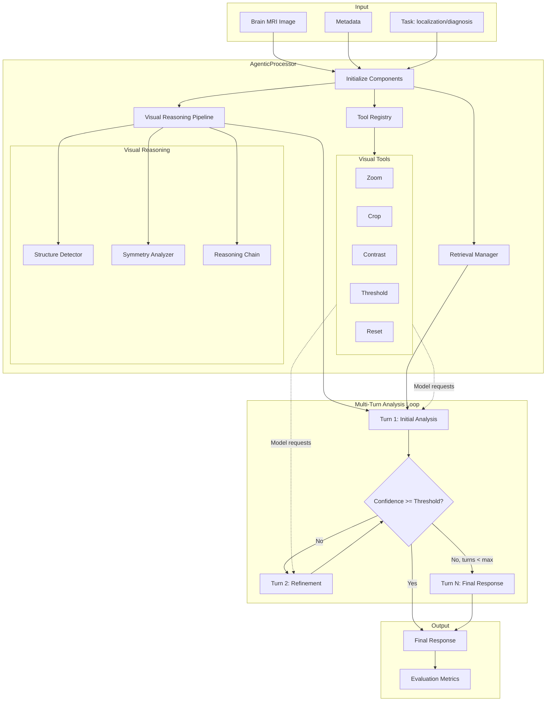
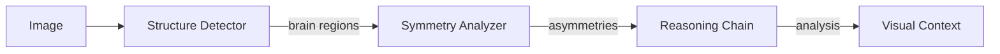
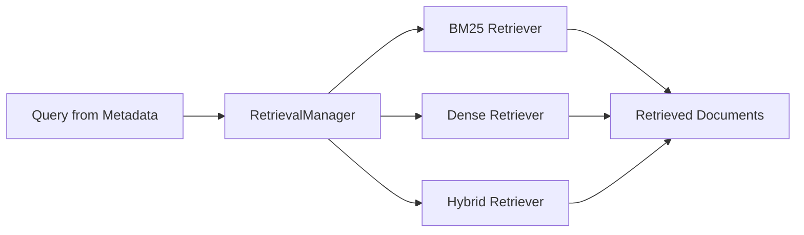
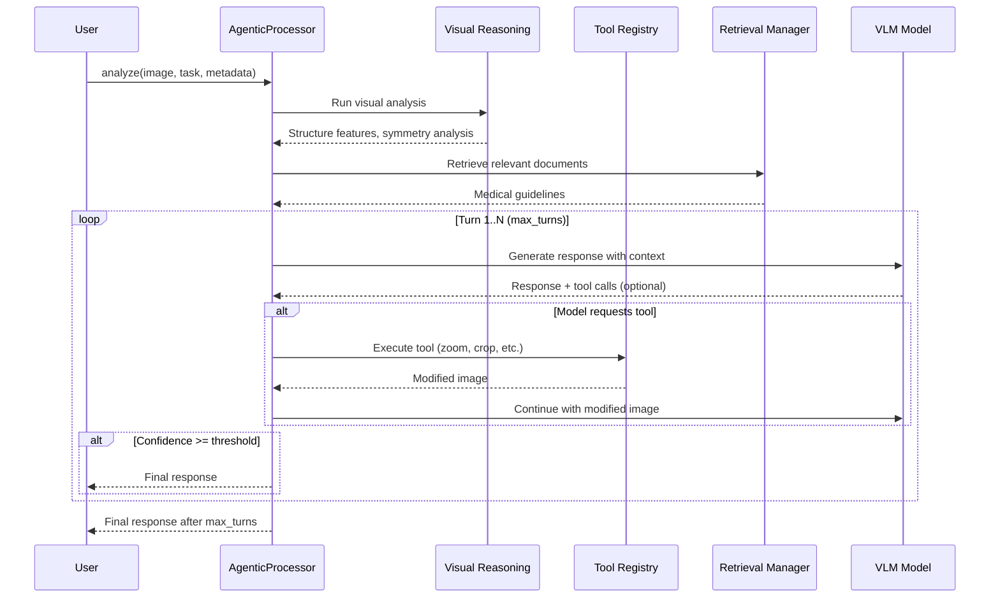

# Agentic Workflow

The agentic processing module enables multi-turn reasoning with visual tools and retrieval integration for medical image analysis.

## Architecture Overview



## Components

### AgenticProcessor

The core processor that orchestrates multi-turn analysis:

```python
from nova_retrieval_vlm.agentic import AgenticProcessor

processor = AgenticProcessor(
    model_name="openai/gpt-4o",
    use_visual_reasoning=True,  # Enable structure detection, symmetry analysis
    use_tools=True,             # Enable visual manipulation tools
    max_turns=5,                # Maximum reasoning turns
)

result = await processor.analyze(
    image_path=Path("scan.png"),
    task="localization",
    metadata={"modality": "MRI", "plane": "axial"},
)
```

### Visual Reasoning Pipeline

Analyzes brain MRI images before model inference:



| Component | Purpose |
|-----------|---------|
| **BrainStructureDetector** | Identifies anatomical regions (ventricles, white matter, cortex) |
| **BilateralSymmetryAnalyzer** | Detects left-right asymmetries indicating pathology |
| **MedicalReasoningChain** | Combines findings into structured analysis |

### Tool Registry

Visual manipulation tools the model can request during analysis:

| Tool | Parameters | Description |
|------|------------|-------------|
| `zoom` | `factor: float` | Magnify image (1.0-4.0x) |
| `crop` | `x1, y1, x2, y2` | Extract region of interest |
| `adjust_contrast` | `factor: float` | Enhance/reduce contrast |
| `threshold` | `min_val, max_val` | Intensity thresholding |
| `reset` | - | Restore original image |

```python
from nova_retrieval_vlm.agentic import ToolRegistry

registry = ToolRegistry()
registry.set_image(image_path)

# Model requests a tool
result = registry.execute("zoom", factor=2.0)
# Returns: ToolResult(success=True, image_base64="...", message="Zoomed 2.0x")
```

### Retrieval Manager

Retrieves relevant medical knowledge during analysis:



```python
from nova_retrieval_vlm.agentic import RetrievalManager

manager = RetrievalManager(
    index_dir=Path("indexes/"),
    retrieval_type="hybrid",  # bm25, dense, or hybrid
    top_k=5,
)

docs = manager.retrieve(
    query="brain MRI lesion differential diagnosis",
    metadata={"modality": "MRI"},
)
```

## Multi-Turn Analysis Flow



### Turn Structure

Each turn produces:

```python
@dataclass
class Turn:
    turn_number: int
    prompt: str
    response: str
    tool_calls: list[dict]  # Tools requested by model
    tokens_used: int
```

### Result Structure

```python
@dataclass
class AgenticResult:
    final_response: str
    turns: list[Turn]
    total_tokens: int
    visual_analysis: RadiologyAnalysis | None  # If visual reasoning enabled
    retrieved_docs: list[str]                   # If retrieval enabled
```

## Task-Specific Processors

### AgenticLocalizationProcessor

For bounding box detection tasks:

```python
from nova_retrieval_vlm.agentic import AgenticLocalizationProcessor

processor = AgenticLocalizationProcessor(config)
responses = await processor.process_batch(batch_data)
metrics = processor.evaluate_responses(responses, ground_truth)
# Returns: mAP@0.5, precision, recall
```

### AgenticDiagnosisProcessor

For differential diagnosis tasks:

```python
from nova_retrieval_vlm.agentic import AgenticDiagnosisProcessor

processor = AgenticDiagnosisProcessor(config)
responses = await processor.process_batch(batch_data)
metrics = processor.evaluate_responses(responses, ground_truth)
# Returns: accuracy, F1, coverage
```

## CLI Usage

```bash
# Enable agentic processing
python -m nova_retrieval_vlm.cli task=localization agentic.enabled=true

# Configure agentic options
python -m nova_retrieval_vlm.cli \
    task=diagnosis \
    agentic.enabled=true \
    agentic.use_visual_reasoning=true \
    agentic.use_tools=true \
    agentic.max_turns=5 \
    agentic.confidence_threshold=0.8

# With retrieval augmentation
python -m nova_retrieval_vlm.cli \
    task=localization \
    agentic.enabled=true \
    use_retrieval=true \
    retrieval.type=hybrid
```

## Configuration

```python
class AgenticConfig(BaseModel):
    enabled: bool = False
    use_visual_reasoning: bool = True
    use_tools: bool = True
    max_turns: int = 3          # 1-10
    confidence_threshold: float = 0.7  # 0.0-1.0
```

## When to Use Agentic Mode

| Scenario | Recommended |
|----------|-------------|
| Simple, clear scans | Standard processor (faster) |
| Complex findings | Agentic with visual reasoning |
| Ambiguous cases | Agentic with retrieval |
| Research/benchmarking | Standard for reproducibility |
| Clinical decision support | Agentic with all features |
