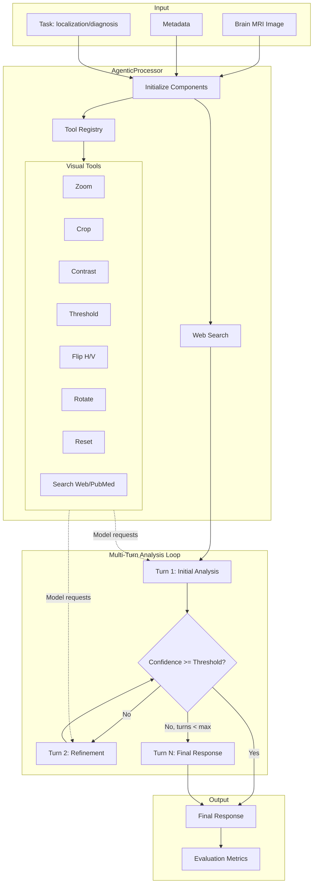
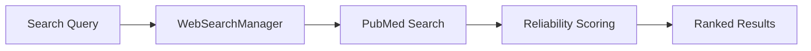
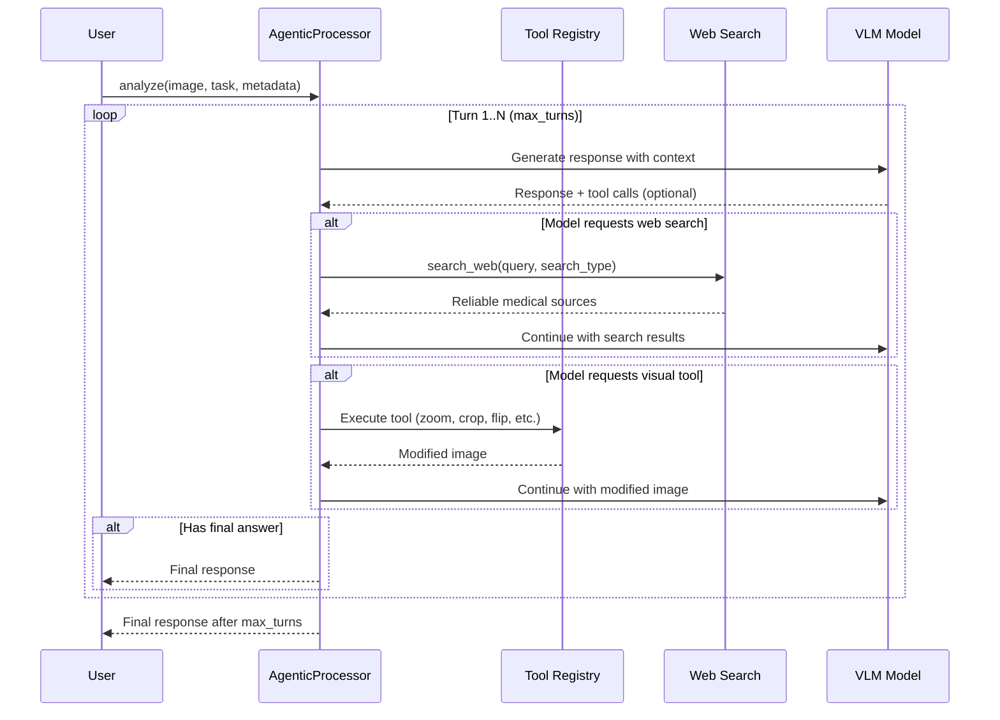

# Agentic Workflow

The agentic processing module enables multi-turn reasoning with visual tools and web search integration for medical image analysis.

## Architecture Overview



## Components

### NOVAAgenticProcessor

The NOVA-specific processor that orchestrates multi-turn analysis using the generic harness:

```python
from src.processor import NOVAAgenticProcessor

processor = NOVAAgenticProcessor(
    model_name="x-ai/grok-4.1-fast:free",
    use_tools=True,             # Enable visual manipulation tools
    max_turns=10,               # Maximum reasoning turns (max 20)
    reasoning_enabled=False,    # Enable reasoning for supported models
)

result = await processor.analyze(
    image_path=Path("scan.png"),
    metadata={"modality": "MRI", "plane": "axial"},
)
```

### Tool Registry

Visual manipulation tools the model can request during analysis:

| Tool | Parameters | Description |
|------|------------|-------------|
| `zoom` | `factor: float` | Magnify image (0.5-4.0x) |
| `crop` | `x1, y1, x2, y2` | Extract region of interest (normalized 0-1) |
| `adjust_contrast` | `factor: float` | Enhance/reduce contrast (0.5-3.0) |
| `threshold` | `lower, upper` | Intensity thresholding (0-255) |
| `flip_horizontal` | - | Mirror image left-right |
| `flip_vertical` | - | Mirror image top-bottom |
| `rotate` | `clockwise: bool` | Rotate 90 degrees |
| `reset` | - | Restore original image |
| `search_web` | `query: str, search_type: str` | Search PubMed literature with reliability scoring |

```python
from radiant_harness import ToolRegistry, create_visual_tools, create_search_tools

# Create registry with visual and search tools
tools = create_visual_tools() + create_search_tools()
registry = ToolRegistry(image_path=image_path, tools=tools)

# Model requests a tool
result = await registry.execute("zoom", factor=2.0)
# Returns: ToolResult(success=True, image_base64="...", description="Zoomed 2.0x")

# Orientation tools
result = await registry.execute("flip_horizontal")
result = await registry.execute("rotate", clockwise=True)

# Web search tool
result = await registry.execute("search_web", query="glioblastoma MRI", search_type="diagnosis")
# Returns: ToolResult(success=True, metadata={...}, description="Found 5 reliable sources")
```

### Web Search Integration

Enhanced web search with medical reliability scoring:



```python
from radiant_harness.retrieval.web_search import search_medical_literature

# Search with automatic query enhancements by search_type
results = await search_medical_literature(
    query="brain MRI lesion differential diagnosis",
    max_results=5,
    search_type="diagnosis",
)

# Each result includes:
for result in results:
    print(f"Title: {result.title}")
    print(f"Reliability: {result.reliability_score:.2f}")
    print(f"Medical relevance: {result.medical_relevance:.2f}")
    print(f"Key entities: {result.extracted_entities}")
```

#### Search Result Structure

```python
@dataclass
class SearchResult:
    title: str                    # Article/paper title
    url: str                      # Source URL
    content: str                  # Extracted content
    reliability_score: float      # 0.0-1.0 based on source authority
    medical_relevance: float      # 0.0-1.0 based on medical content
    extracted_entities: list[str] # Medical terms/concepts
```

## Multi-Turn Analysis Flow



### Turn Structure

Each turn produces:

```python
@dataclass
class Turn:
    role: str  # 'assistant' or 'tool_result'
    content: str
    tool_calls: list[dict]  # Tools requested by model
    tool_results: list[ToolResult]
```

### Result Structure

```python
@dataclass
class AgenticResult:
    final_response: dict[str, Any]
    turns: list[Turn]
    total_tokens: int
    search_results: list[SearchResult]  # Web search results
    confidence: float
```

## Task-Specific Processors

### Using NOVAAgenticProcessor for Different Tasks

The NOVAAgenticProcessor handles all tasks (captioning, diagnosis, localization) in a unified analysis:

```python
from src.processor import NOVAAgenticProcessor

processor = NOVAAgenticProcessor(
    model_name="openai/gpt-4o",
    use_tools=True,
    use_web_search=True,
    max_turns=10,
)

result = await processor.analyze(
    image_path=Path("brain_mri.png"),
    metadata={"history": "Headache for 2 weeks"},
)

# Access unified response
print(result.final_response["caption"])
print(result.final_response["diagnosis"])
print(result.final_response["localization"])
```

## CLI Usage

```bash
# Enable visual tools
python -m src.cli \
    --task localization \
    --model x-ai/grok-4.1-fast:free \
    --use-tools

# Reasoning with bounded turns
python -m src.cli \
    --task diagnosis \
    --model x-ai/grok-4.1-fast:free \
    --use-tools \
    --max-turns 10 \
    --reasoning

# Web search enabled
python -m src.cli \
    --task diagnosis \
    --model x-ai/grok-4.1-fast:free \
    --use-tools \
    --use-web-search \
    --max-turns 15
```

## When to Use Agentic Mode

| Scenario | Recommended |
|----------|-------------|
| Simple, clear scans | Standard processor (faster) |
| Complex findings | Agentic with tools |
| Need literature search | Agentic with search_web (PubMed) |
| Need comparison images | Agentic with search_images (Open-i) |
| Ambiguous cases | Agentic with web search + tools |
| Research/benchmarking | Standard for reproducibility |
| Clinical decision support | Agentic with all features |

## Web Search Best Practices

The enhanced `search_web` tool follows LLM agent best practices:

### 1. **Reliability Scoring**
- PubMed/NCBI articles: ~0.95 (peer-reviewed)
- Government/academic domains (.gov, .edu, .ac.uk): ~0.80
- Major medical publishers: ~0.85
- Other sources: 0.60 (default)

### 2. **LLM-Friendly Formatting**
```python
# search_web returns formatted text for direct model consumption:
result = await registry.execute(
    "search_web",
    query="glioblastoma MRI findings differential diagnosis",
    search_type="diagnosis",
)
formatted_results = result.metadata["formatted_results"]
```

### 3. **Medical Entity Extraction**
- Automatic extraction of medical terms, conditions, and procedures
- Helps models understand relevance and context
- Supports differential diagnosis reasoning

### 4. **Error Handling & Retry Logic**
- Graceful degradation when sources are unavailable
- Automatic retry with exponential backoff

### Usage Examples

```python
# Search for specific conditions
registry.execute("search_web",
    query="glioblastoma MRI findings differential diagnosis",
    search_type="diagnosis")

# General medical information
registry.execute("search_web",
    query="brain tumor types MRI characteristics",
    search_type="general")

# Reference images
registry.execute("search_images",
    query="meningioma MRI T1 with contrast",
    modality="MRI")
```

## Architecture Benefits

1. **Fully Agentic**: No static knowledge base - the model actively searches
2. **Up-to-Date**: Always accesses latest medical literature
3. **Reliable**: Source prioritization and scoring ensure quality
4. **Flexible**: Query enhancements for diagnosis, guidelines, research, anatomy, treatment, differential, general
5. **LLM-Optimized**: Tool results include formatted summaries for model reasoning
