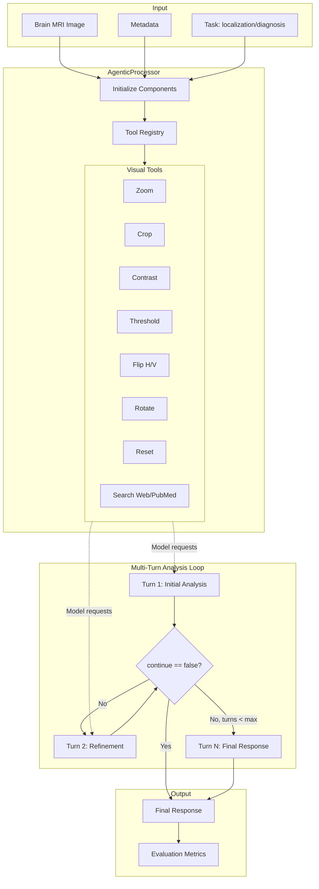
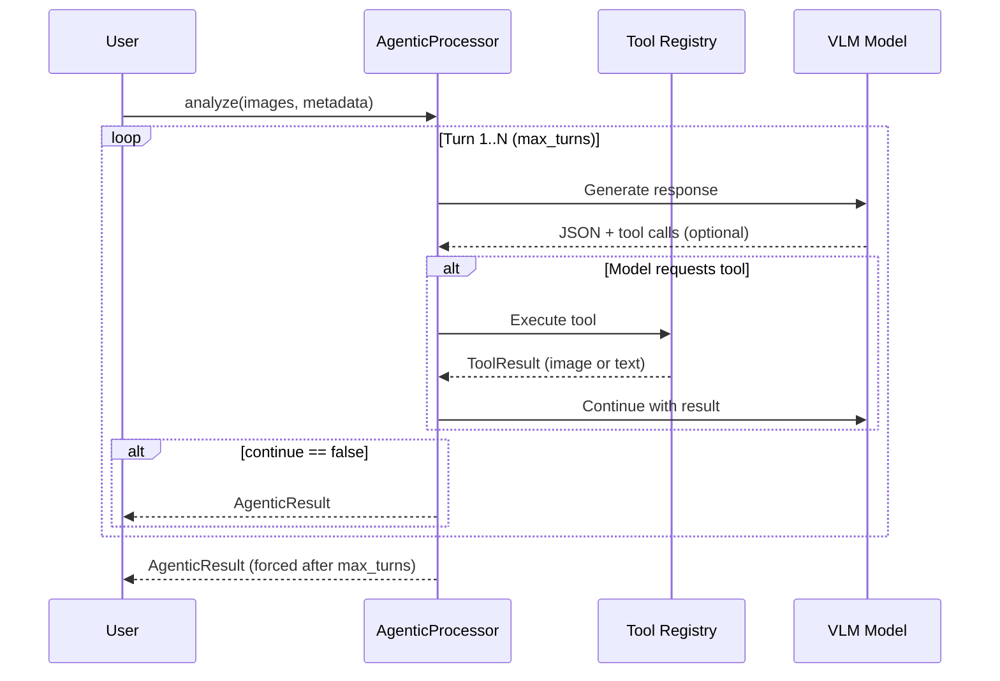

# Agentic Workflow

Multi-turn reasoning with visual tools and web search for medical image analysis.

## Architecture



## NOVAAgenticProcessor

```python
from examples.nova.src.processor import NOVAAgenticProcessor

processor = NOVAAgenticProcessor(
    model_name="openai/gpt-4o",
    use_tools=True,
    max_turns=10,
    reasoning_enabled=False,
)

result = await processor.analyze(
    images=Path("scan.png"),
    metadata={"modality": "MRI", "plane": "axial"},
)
```

`analyze()` accepts:
- `images` -- `Path`, `PIL.Image.Image`, list of either, or `None` for text-only
- `metadata` -- dict with clinical context
- `image_labels` -- optional labels for each image (e.g., `["T1", "T2-FLAIR"]`)

Returns `AgenticResult`.

## Tools

| Tool | Parameters | Description |
|------|------------|-------------|
| `zoom` | `factor: float` | Magnify image (0.5--4.0x) |
| `crop` | `x1, y1, x2, y2` | Extract region (normalized 0--1) |
| `adjust_contrast` | `factor: float` | Contrast enhancement (0.5--3.0) |
| `threshold` | `lower, upper` | Intensity thresholding (0--255) |
| `flip_horizontal` | -- | Mirror left-right |
| `flip_vertical` | -- | Mirror top-bottom |
| `rotate` | `clockwise: bool` | Rotate 90 degrees |
| `reset` | -- | Restore original image |
| `search_web` | `query, search_type` | PubMed literature search |
| `search_images` | `query, modality` | Open-i image search |

```python
from radiant_harness import ToolRegistry, create_visual_tools, create_search_tools

tools = create_visual_tools() + create_search_tools()
registry = ToolRegistry(image_path=image_path, tools=tools)

result = await registry.execute_tool("zoom", factor=2.0)
# ToolResult(success=True, image_base64="...", description="Zoomed 2.0x")
```

## Multi-Turn Flow



Each turn, the model returns JSON with `"continue": true` or `"continue": false`. When `continue` is false (or max turns reached), the response is finalized.

## Result Types

```python
@dataclass(frozen=True)
class AgenticResult:
    final_response: dict[str, Any]   # Complete JSON from the model
    turns: list[Turn]                # All conversation turns
    total_tokens: int                # Tokens consumed across all turns
    confidence: float                # 0.0--1.0

@dataclass(frozen=True)
class Turn:
    role: TurnRole                   # "user", "assistant", or "tool_result"
    content: str
    tool_calls: list[ToolCall]
    tool_results: list[ToolResult]
    image_base64: str | None
```

## Web Search

PubMed search via NCBI E-utilities with reliability scoring:

```python
from radiant_harness.retrieval.web_search import search_medical_literature

results = await search_medical_literature(
    query="brain MRI lesion differential diagnosis",
    max_results=5,
    search_type="diagnosis",
)

for result in results:
    print(f"{result.title} (reliability: {result.reliability_score:.2f})")
```

Reliability scores are based on source authority: PubMed articles (~0.95), government/academic domains (~0.80), major publishers (~0.85).

## CLI

```bash
# Visual tools
uv run python -m src.cli \
    --task localization \
    --model openai/gpt-4o \
    --use-tools

# Tools + web search
uv run python -m src.cli \
    --task diagnosis \
    --model openai/gpt-4o \
    --use-tools \
    --use-web-search \
    --max-turns 10
```
